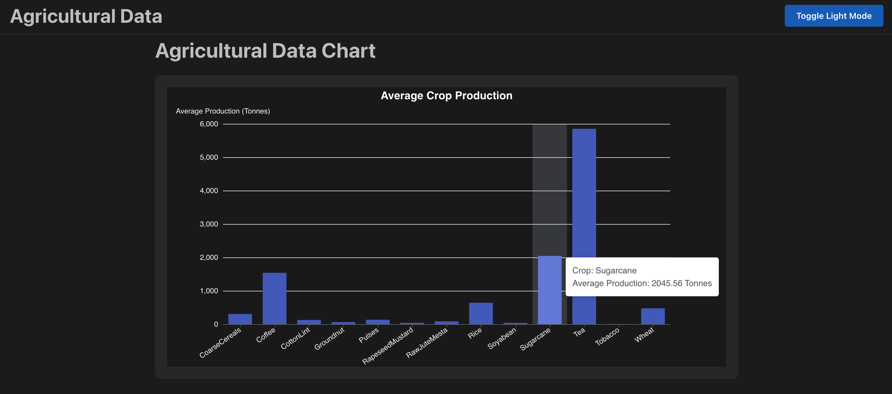
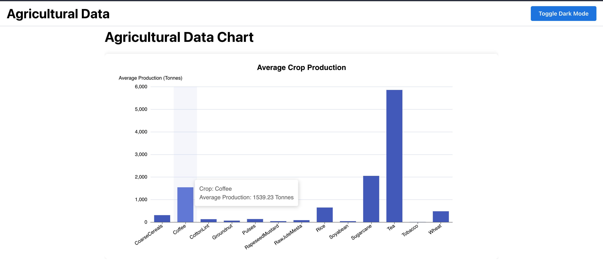
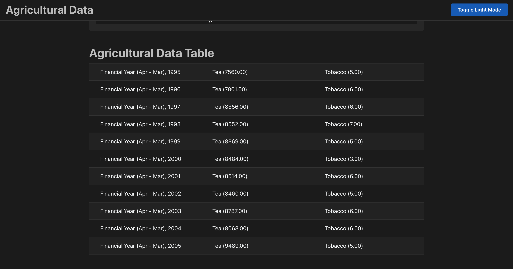
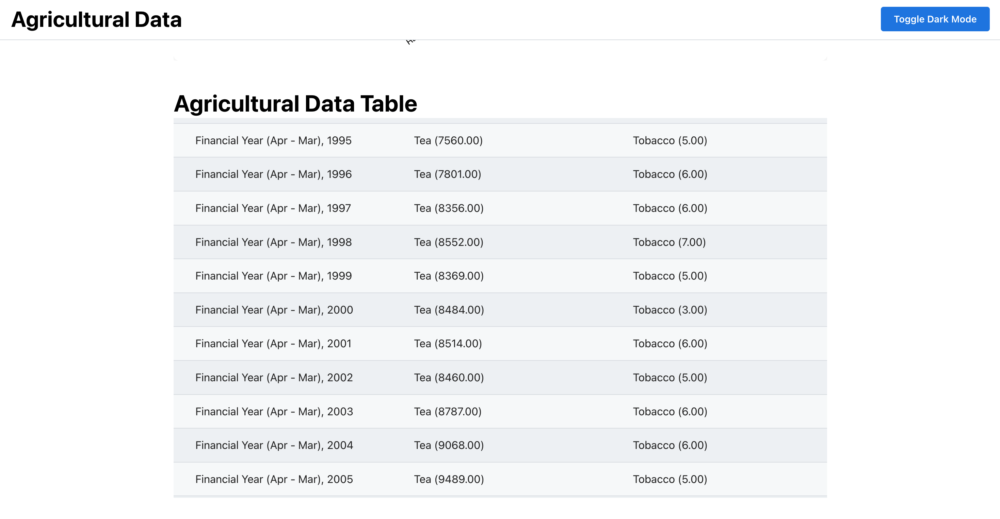

# Shashank Project

Get started with the template by clicking `Use this template` button on the top of the page.

[Documentation](https://mantine.dev/guides/vite/)

## How to Run the Project

This project uses [Yarn](https://yarnpkg.com/).

1.  **Install dependencies:**

    ```bash
    yarn install
    ```

2.  **Start the development server:**

    ```bash
    yarn dev
    ```

## Images

The following images are available in the `public/assets` directory:

*   `chart_dark.png`
    
*   `chart_light.png`
    
*   `table_dark.png`
    
*   `table_light.png`
    
